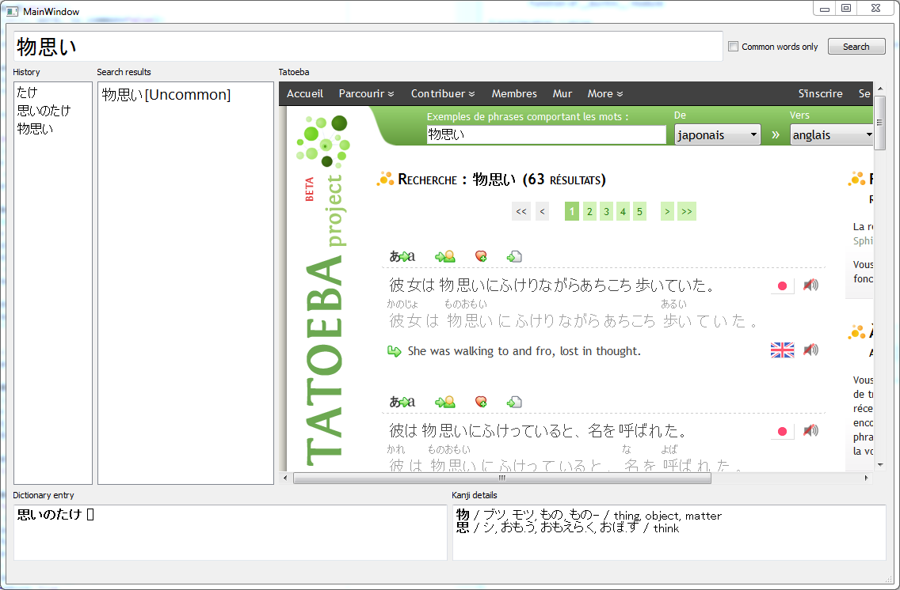

KanjiExplorer
=============

A dictionary, kanji-checker and Tatoeba example browser built on top of the JMDict and Kanjidic databases.

# Features

- click on any expression in the expression panel to see its definition (if it exists)
- toggle between only common expressions containing the search terms and all matches including seldomly used ones
- double-click on any expression in the expression panel to copy it to the search bar and update the GUI
